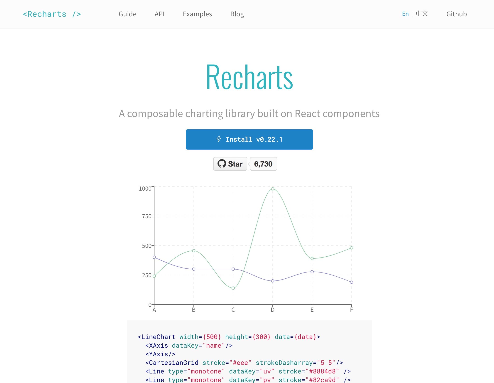

title: Charts in React, The right way
author:
  name: Alberto Restifo
  twitter: albertorestifo
controls: false
theme: ./theme

-- intro

# Charts in React
## The Right Way

-- sentisis

# I'm Alberto Restifo
## I work at Séntisis


--

#  This year I made many charts
## Responsive, interactive and animated

-- chart-videos

<div id="area-1">
  <video class="video-height" autoplay muted loop>
    <source src="videos/line-chart.mp4" type="video/mp4" />
  </video>
</div>
<div id="area-2">
  <video class="video-height" autoplay muted loop>
    <source src="videos/bar-chart.mp4" type="video/mp4" />
  </video>
</div>
<div id="area-3">
  <video class="video-width" autoplay muted loop>
    <source src="videos/analyze.mp4" type="video/mp4" />
  </video>
</div>
<div id="area-4">
  <video class="video-width" autoplay muted loop>
    <source src="videos/bubble-chart.mp4" type="video/mp4" />
  </video>
</div>

-- flex-start light

### I couldn't use an existing library



--

# How?

--

# Using ref

It's the most common solution you'll see around the web

-- code

```js
class LineChart extends Component {
  componentDidMount() {
    this.renderChart();
  }

  renderChart() {
    const svg = select(this.containerEl);
    // ... more d3 logic
  }

  render() {
    return (
      <svg
        width="960"
        height="500"
        ref={el => this.containerEl = el}
      />
    );
  }
}
```

--

# What's wrong with this?
## It gets the job done.

--

# Two DOM libraries
## React and D3 are both manipulating the DOM

-- code

```js
class LineChart extends Component {
  componentDidMount() { /* ... */ }

  componentWillUnmount() {
    // Remove D3 event listeners,
    // Stop any running animation,
    // ...
  }

  renderChart() { /* ... */ }

  render() { /* ... */ }
}
```

--

# Reacting to updates
## Becomes more complex

-- code

```js
class LineChart extends Component {
  componentDidMount() { /* ... */ }

  componentDidUpdate(prevProps) {
    if (prevProps.data !== this.props.data) {
      // We need to make sure the render function can correctly 
      // render multiple times when invoked with different data
      this.renderChart();
    }
  }

  componentWillUnmount() { /* ... */ }

  renderChart() { /* ... */ }

  render() { /* ... */ }
}
```

--

# Handling interactions
## The graph lives in it's own world, isolated from the ecosystem of your app

-- code

```js
renderChart() {
  const { onClickPoint } = this.props;

  // ... Omitted logic

  g.selectAll('dot')
    .data(data)
    .enter().append('circle')
      .attr('r', 4)
      .attr('cx', d => x(d.date))
      .attr('cy', d => y(d.close))
      .attr('fill', 'white')
      .attr('stroke', 'steelblue')
      .attr('stroke-width', 2.5)
      .on('click', d => onClickPoint(d));
}
```

--

# And then we have tooltips
## Where you have to inline HTML.

-- code

```js
g.selectAll('dot')
  .data(data)
  .enter().append('circle')
    // ... omitted logic
    .on('mouseover', (d) => {
      div.html(`
          <span class="date">${formatTime(d.date)}</span>
          <span class="value">${d.close}</span>
        `)
        .style('opacity', .9)
        .style('left', `${event.pageX}px`)
        .style('top', `${event.pageY - 28}px`);
    })
    .on('mouseout', (d) => {
      div.style('opacity', 0);
    });
```

--

<video class="bk-video" autoplay muted loop>
  <source src="videos/crazy-pills.mp4" type="video/mp4" />
</video>

--

# We can do better.

--

# React creates the SVG
## D3 computes the graph

--

# Understand what D3 does
## Let's have a look

--

# The SVG

-- code

```js
const svg = d3.select(this.containerEl);
const g = svg.append('g')
  .attr('transform', `translate(${margin.left}, ${margin.top})`);
```

-- code

```html
<svg width="960" height="500">
  <g transform="translate(35, 20)">
    <!-- Omitted -->
  </g>
</svg>
```

-- code

```js
  render() {
    return (
      <svg width={width} height={height}>
        <g transform={`translate(${margin.left}, ${margin.top})`}>
        </g>
      </svg>
    );
  }
```

--

# The path

-- code

```js
// Create the drawing function
const line = d3.line()
  .x(d => x(d.date))
  .y(d => y(d.close));

// Append the path to the group
g.append('path')
  .datum(data)
  .attr('fill', 'none')
  .attr('stroke', 'steelblue')
  .attr('stroke-linejoin', 'round')
  .attr('stroke-linecap', 'round')
  .attr('stroke-width', 2.5)
  .attr('d', line);
```

-- doc

# d3.line()

Constructs a new line generator with the default settings.

# _line_(data)

Generates a line for the given array of data. [...]

# _line_.x([x])

If x is specified, sets the x accessor to the specified function or number and 
returns this line generator. [...]

# _line_.y([y])

If y is specified, sets the y accessor to the specified function or number and 
returns this line generator. [...]

-- code

```js
const { data } = this.props;

const line = d3.line()
  .x(d => x(d.date))
  .y(d => y(d.close));

return (
  <svg width={width} height={height}>
    <g transform={`translate(${margin.left}, ${margin.top})`}>
      <path
        d={line(data)}
        fill="none"
        stroke="steelblue"
        strokeLinejoin="round"
        strokeLinecap="round"
        strokeWidth="2.5"
      />
    </g>
  </svg>
);
```

-- code

```js
componentWillMount() {
  const { width, height, margin, data } = this.props;

  const x = scaleTime()
    .rangeRound([0, width - margin.left - margin.right])
    .domain(extent(data, d => d.date));

  const y = scaleLinear()
    .rangeRound([height - margin.top - margin.bottom, 0])
    .domain(extent(data, d => d.close));

  const graphData = data.map((d) => ({
    ...d,
    x: x(d.date),
    y: y(d.close),
  }));

  this.setState({ data: graphData });
}
```

-- code

```diff
 const line = d3.line()
-  .x(d => x(d.date))
-  .y(d => y(d.close));
+  .x(d => d.x)
+  .y(d => d.y);
```

--

# The points

-- code

```js
g.selectAll('dot')
  .data(data)
  .enter().append('circle')
    .attr('r', 4)
    .attr('cx', d => x(d.date))
    .attr('cy', d => y(d.close))
    .attr('fill', 'white')
    .attr('stroke', 'steelblue')
    .attr('stroke-width', 2.5);
```

-- code

```html
<svg width="960" height="500">
  <g transform="translate(35, 20)">
    <!-- <path> omitted -->

    <circle r="4" cx="905" cy="457" fill="white" stroke="steelblue" stroke-width="2.5"></circle>
    <circle r="4" cx="880" cy="460" fill="white" stroke="steelblue" stroke-width="2.5"></circle>
    <circle r="4" cx="804" cy="450" fill="white" stroke="steelblue" stroke-width="2.5"></circle>
    <!-- ...and so on -->
  </g>
</svg>
```

-- code

```js
const Point = ({ d }) => (
  <circle
    cx={d.x}
    cy={d.y}
    r="4"
    fill="white"
    stroke="steelBlue"
    strokeWidth="2.5"
  />
);
```

-- code

```js
const { data } = this.state;

return (
  <svg width={width} height={height}>
    <g transform={`translate(${margin.left}, ${margin.top})`}>
      <path d={line(data)} />

      {data.map((d, i) => (
        <Point key={i} d={d} />
      ))}

    </g>
  </svg>
);
```

--

# The tooltip

-- code

```js
const div = d3.select(this.tooltipEl)
  .style('opacity', 0);

g.selectAll('dot')
  .data(data)
  .enter().append('circle')
    // omitted logic to create the points
    .on('mouseover', (d) => {
      div.html(`
        <span class="date">${formatTime(d.date)}</span>
        <span class="value">${d.close}</span>
        `)
        .style('opacity', .9)
        .style('left', `${event.pageX}px`)
        .style('top', `${event.pageY - 28}px`);
    })
    .on('mouseout', (d) => {
      div.style('opacity', 0);
    });
```

-- code

```js
const formatTime = timeFormat("%e %B");

const Tooltip = ({ hidden, d }) => (
  <div
    style={{
      opacity: hidden ? 0 : 0.9,
      transform: `translate(${d.x}px, ${d.y - 35}px)`,
    }}
  >
    <span className="date">{formatTime(d.date)}</span>
    <span className="value">{d.close}</span>
  </div>
);
```

-- code

```js
render() {
  const { isTooltipVisible, tooltipDate } = this.state;

  return (
    <div
      style={{
        width: `${width}px`,
        height: `${height}px`,
        position: 'relative',
      }}
    >
      <Tooltip hidden={!isTooltipVisible} d={tooltipData} />

      <svg>
        ...
      </svg>
    </div>
  );
}
```

-- code

```js
// Point
const Point = ({ d, onMouseEnter, onMouseLeave }) => (
  <circle
    ...
    onMouseEnter={() => onMouseEnter(d)}
    onMouseLeave={() => onMouseLeave(d)}
  />
);

// LineChart -> render
data.map((d, i) => (
  <Point
    key={i}
    d={d}
    onMouseEnter={this.handleMouseEnterPoint}
    onMouseLeave={this.handleMouseLeavePoint}
  />
))}
```

--

# The axis

-- code

```js
// x axis
g.append('g')
  .attr('transform', `translate(0, ${height - margin.top - margin.bottom})`)
  .call(axisBottom(x))
  .select('.domain')
  .remove();

// y axis
g.append('g')
  .call(axisLeft(y))
  .append('text')
  .attr('fill', '#000')
  .attr('transform', 'rotate(-90)')
  .attr('y', 6)
  .attr('dy', '0.71em')
  .attr('text-anchor', 'end')
  .text('Price ($)');
```

-- code

```js
const { width, height, margin } = this.props;
const { data } = this.state;

return (
  <div
    style={{
      width: `${width}px`,
      height: `${height}px`,
      position: 'relative',
    }}
  >
    {/* Tooltip and chart omitted */}

    <XAxis data={data} width={width} margin={margin} />
    <YAxis data={data} height={height} margin={margin} />
  </div>
);
```

-- doc

# d3.extend(_array[, accessor]_)

Returns the minimum and maximum value in the given array using natural order.

# d3.ticks(_start, stop, count_)

Returns an array of approximately count + 1 uniformly-spaced, nicely-rounded values between start and stop (inclusive).

-- code

```js
const [min, max] = extent(data, d => d.date);

const values = ticks(min, max, 5);
```

